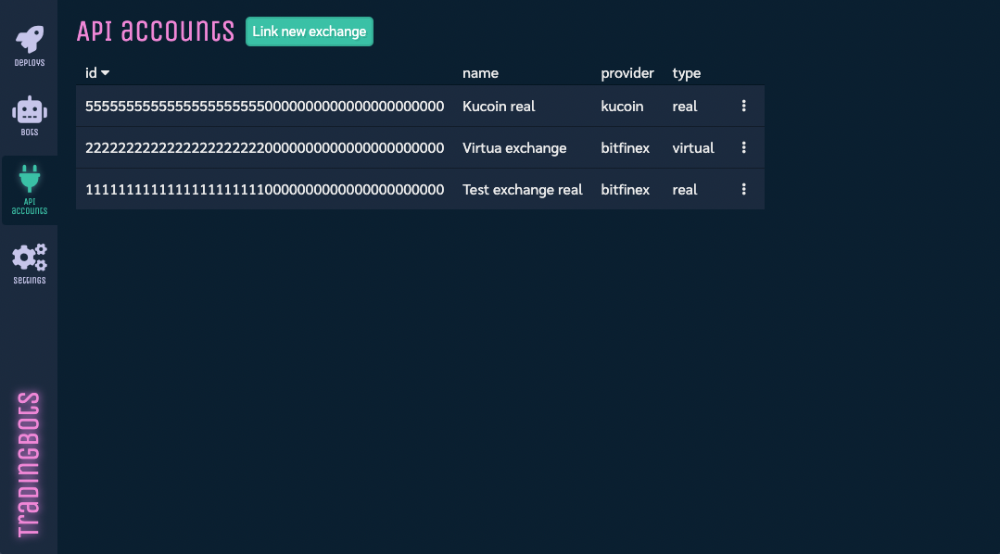
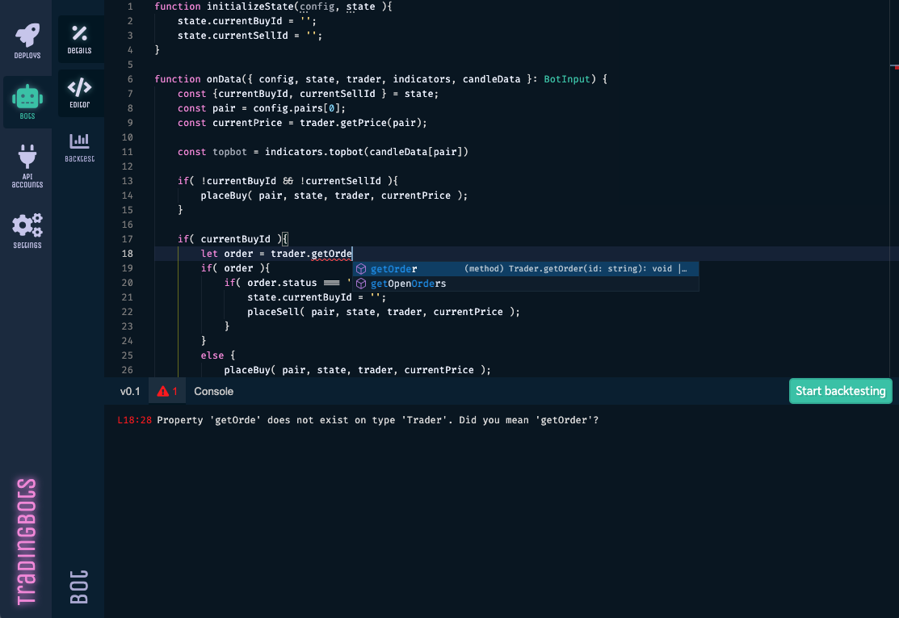
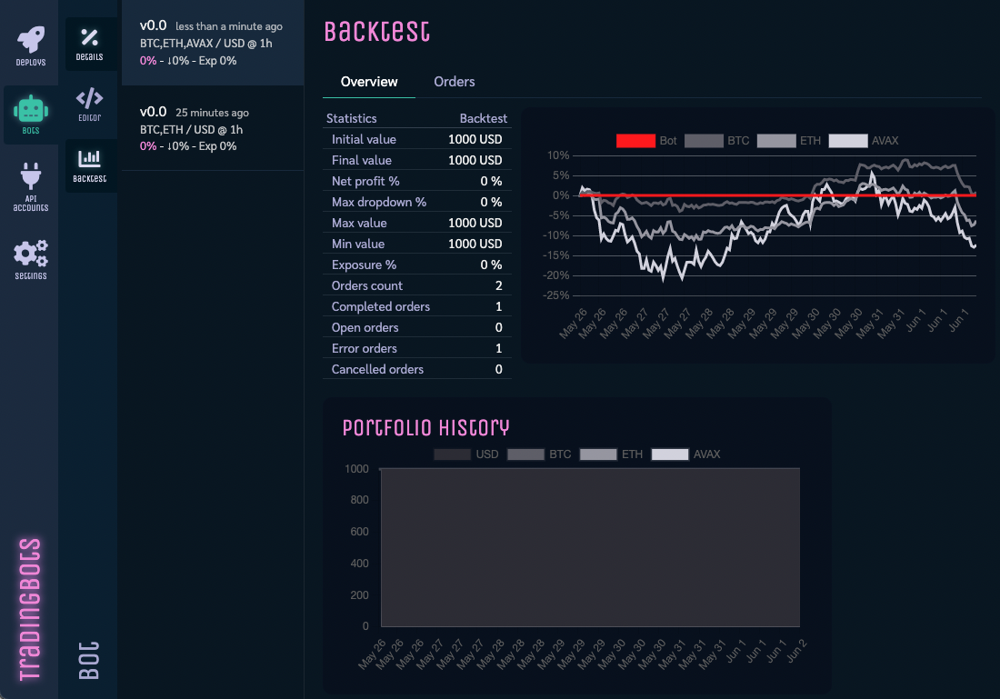
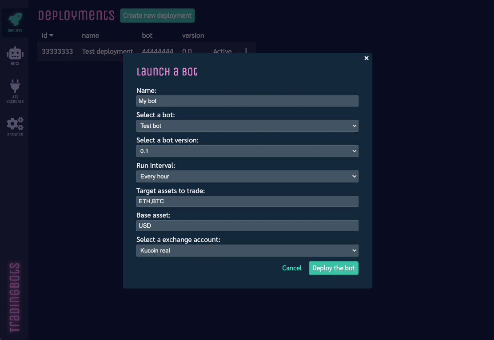

AWS Trader
----------

This is a complete platform that allows to program crypto trading bots in TypeScript and run them in configurable intervals in AWS lambda functions. This is a personal project that is in progress (it probably will never be finished, since there isn't any funds for it).

The idea was inspired by [Trality](https://www.trality.com/), a platform to program bots in python. Why wouldn't have the same in Javascript (the most used programming language)?

# Product overview

Here's the most important concepts of the platform.

## Exchanges

The idea is having a platform where users can link their exchange accounts via API keys so the bots can actually trade on their behalf.



The exchange integrations are plugable, so it's possible to create adapters for different crypto exchanges and they will be supported automatically by the platform. Currently [there are adapters already working](lambdas/_common/exchanges/adapters) for:
* Bitfinex
* Kraken
* Kucoin
* Virtual (Gets other adapter as configuration to get prices and virtually execute orders)

## Bots

The most flexible (and nerdy) part of the platform is the bot creation. Users can create as many bots that they want. The platform provides a trading API in TypeScript and an online editor with autocomplete capabilities to make the bot programming simpler.



Bots can be backtested with real exchange data, and real trading pairs to assess their profitability.




Bot versions and backtest historical data is stored by the platform to help the user improve the bot performance.

## Deployments

When users are happy with their bots, they can deploy them to the cloud with one click. That will run the bots periodically at the specified interval, feeding them with the current price to let the bot buy/sell assets automatically.



Stats and logs are available for every deployment to check how the bot is doing at any time, as well as options to stop, delete or update the bot to a new version.


# Engineering overview

Choosing Javascript for programing and running the bots bring some advantages over python. The main one is being able to use the same engine to run the bots in the cloud (for the deployments) and in the browser (for backtesting), making sure that the results will be the same.

Also, running user code directly in our servers will raise all the alarms of any software engineer! That's where lambdas come to help, so we can execute bots in isolated environments and we need to design our platform in a way that those lambdas get the data injected, instead of allowing the bot to communicate with the external world.

The same paradigm can be used in the browser by make the bots run in web workers. They are injected with the data in the same way than in the lambda, and running backtesting won't affect the web app performance.

The project uses [serverless](https://www.serverless.com/) to easily deploy the lambdas and also execute the whole stack localy.

All the data is stored in dynamo DB, since it's the simplest DB to setup in the lambda environments (yes, I'm only one person coding, so usually I need to use some technologies for this reason).

In the frontend, React + TypeScript was my preferred technology. Bot code edition is possible thanks to the [Monaco editor](https://microsoft.github.io/monaco-editor/), the same one used by VS code. This editor helps a lot with the autocompletion and linting of the bot code, so I just needed to focus on good type definitions (TS) to get the autocompletion for the trading API to make development more friendly.

The trading API provides different helpers to make simple place buy/sell orders, technical indicators to buy/sell and plot methods to monitor how the bots are behaving.

## Install
The repo contains the backend and the frontend for the platform. We need to install dependencies for both:

```cmd
# Frontend
cd src/apptrice
npm install

# Backend
cd src/lambdas
npm install
```

## Run it locally
The repo makes use of serverless-offline to emulate the aws environment and lambdas. There are some commands in the package.json to run the platform locally:
```cmd
npm run dynamo:serve
npm run lambda:serve
npm run app:serve
```

## Deploy it to AWS

AWS credentials need to be set in you `.aws` directory, and then the current command will set up the needed infrastructure in AWS:
```
npm run deploy
```


